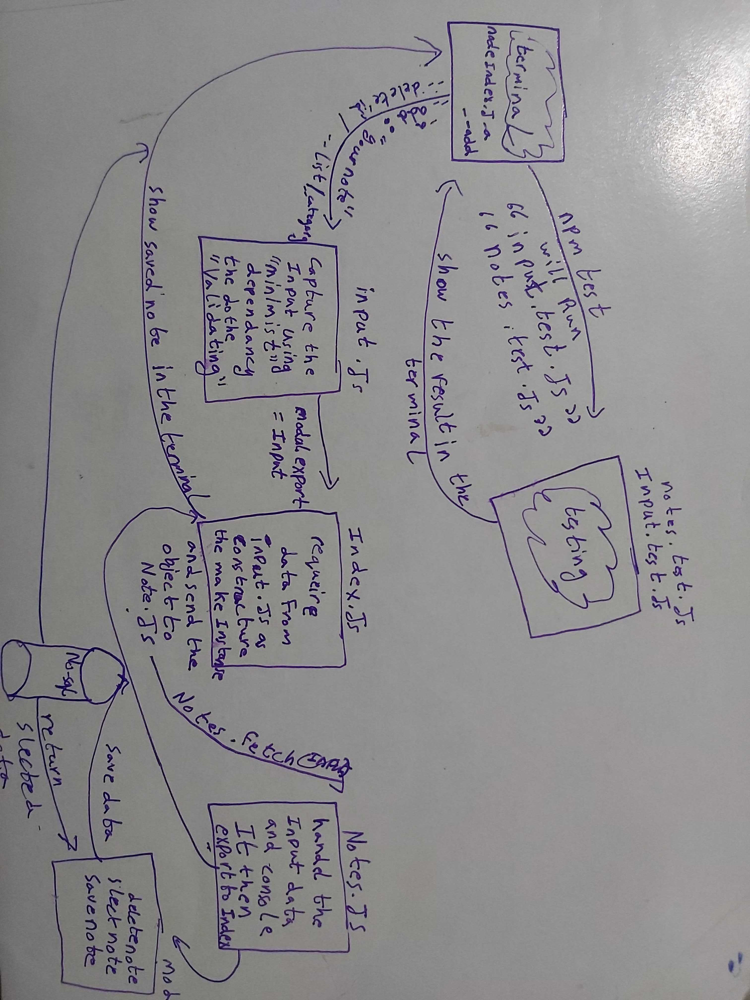

# LAB - 04

<!-- ## Project: Project Name Here -->
## Advanced Mongo/Mongoose

### Author: Abdallah Obaid

### Links and Resources

* [submission PR](https://github.com/Abdallah-401-advanced-javascript/notes/pull/5)
* [travis](https://travis-ci.com/github/Abdallah-401-advanced-javascript/notes)
* [ci/cd](https://github.com/Abdallah-401-advanced-javascript/notes/runs/690942657)
<!-- - [back-end server url](http://xyz.com) (when applicable) -->
<!-- * [front-end application](https://abdallah-lab-00.herokuapp.com/)  -->

### Documentation
<!-- * [jsdoc](https://abdallah-lab-00.herokuapp.com/docs/) -->

### Modules
#### `input.js` , `notes.js` , `notes-schema.js`
##### Exported Values and Methods

###### `node index.js -a or --add"any text" ->any text saved `
Return the text you that the client enter or error message if he did not enter anything or when use wrong flag.
We will test our code using `input.test.js` `notes.test.js`.
Make a database and store or notes inside it and read from database and delete any note using the id. 

### Setup

#### `.env` requirements 
const DB_URI = 'mongodb://localhost:27017/firstDatabase';

#### How to initialize/run your application 

* `npm init -y`
* Use node index.js -a 'your note'|| use node index.js -add 'your note'
  *Returns a note and method. 
* You can use #!/usr/bin/env node in your index.js file and chmod +x index.js to change the mode for the index file and make it excutable, the run it with ./index.js
* You can add category (--category) for any note and also you can save(-a/--add)/delete(--delete "id")/read (--list "any category" or you can simple write --list to show all stored notes) any note you want.
* `npm i -D jest` so you cant use jest test.
* run the `npm test` to test your code. 

#### How to use your library (where applicable)
* use const lib=require('lib')
#### Tests

* Unit Tests: `npm test`

* Lint Tests: `npm run lint`

<!-- Incomplete Tests: -->

#### UML

