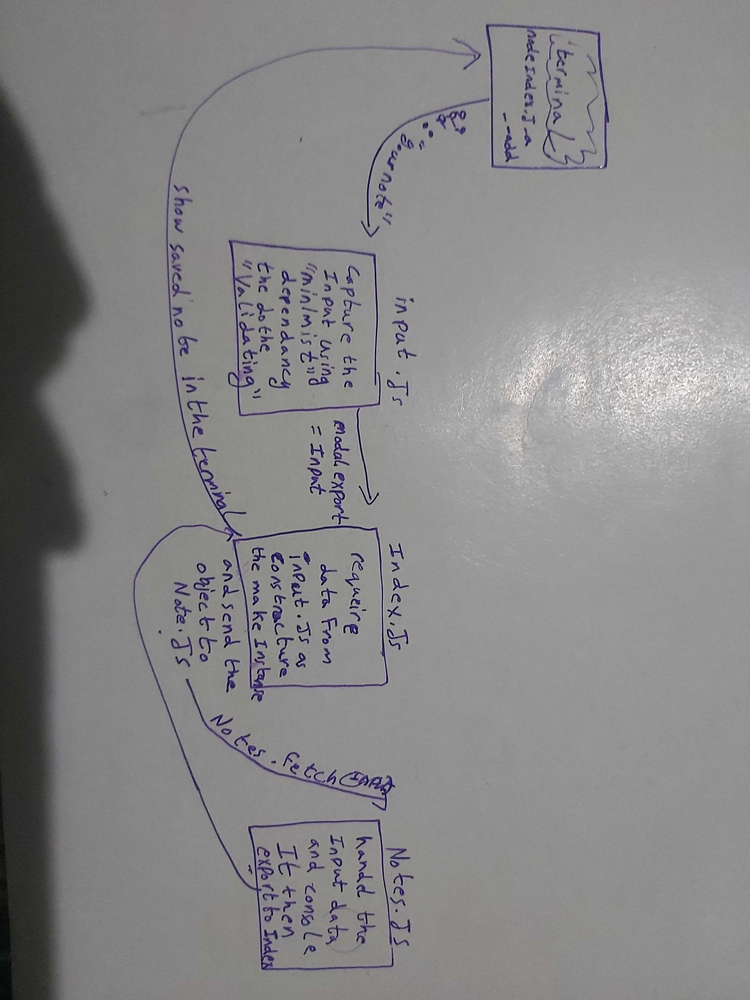

# LAB - 01

<!-- ## Project: Project Name Here -->
## Standard Node.js Applications

### Author: Abdallah Obaid

### Links and Resources

* [submission PR](https://github.com/Abdallah-401-advanced-javascript/notes/pull/1)
<!-- * [travis](https://travis-ci.com/github/Abdallah-401-advanced-javascript/lab-00) -->
<!-- - [ci/cd](http://xyz.com) (GitHub Actions) -->
<!-- - [back-end server url](http://xyz.com) (when applicable) -->
<!-- * [front-end application](https://abdallah-lab-00.herokuapp.com/)  -->

### Documentation
<!-- * [jsdoc](https://abdallah-lab-00.herokuapp.com/docs/) -->

### Modules
#### `input.js` , `notes.js`
##### Exported Values and Methods

###### `node index.js -a or --add"any text" -> any text`
Return the text you that the client enter or error message if he did not enter anything or when use wrong flag.

### Setup

#### `.env` requirements 
no api or db for naw.

#### How to initialize/run your application 

* `npm init -y`
* use node index.js -a 'your note'|| use node index.js -add 'your note'
  *Returns a note and method. 
* you can use #!/usr/bin/env node in your index.js file and chmod +x index.js to change the mode for the index file and make it excutable, the run it with ./index.js

#### How to use your library (where applicable)

#### Tests

<!-- * Unit Tests: `npm test` -->
* Lint Tests: `npm run lint`

<!-- Incomplete Tests: -->

#### UML

